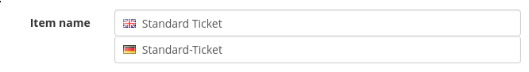

Working with forms
==================

Fields and Widgets
------------------

If you use a ``ModelForm``, you will automatically get an ``I18nFormField`` field
for your internationalized fields with the default widget being either an ``I18nTextInput``
or an ``I18nTextarea`` being the default widget. But of course you can also use these
fields manually as you would use any other field, even completely without touching models.

.. autoclass:: i18nfield.forms.I18nFormField

.. autoclass:: i18nfield.forms.I18nTextInput

.. autoclass:: i18nfield.forms.I18nTextarea

Widget styling
--------------

The form widget will output something similar to the following HTML sample:

.. code-block:: html

    

        <input class="form-control" id="id_name_0" lang="en"
               maxlength="200" name="name_0" placeholder="Name" title="en"
               type="text" value="">
        <input class="form-control" id="id_name_1" lang="de"
               maxlength="200" name="name_1" placeholder="Name" title="de"
               type="text" value="">
    

This alone provides no good indication to your user on which field resembles which language
(except the title attribute that is visible on mouseover in most browsers). Also, it will
render the input forms in a row by default, why we find it more understandable if they are
arranged vertically.

You can achieve all this with a little bit of CSS. We can't give you the full details, as we
don't know how you style form widgets in general in your project.

To indicate the language, we use the following CSS to draw a little flag at the beginning of
the input field:

.. code-block:: css

    input[lang] {
      background: no-repeat 10px center;
      padding-left: 34px;
    }
    textarea[lang] {
      background: no-repeat 10px 10px;
      padding-left: 34px;
    }
    input[lang=de], textarea[lang=de] {
      background-image: url('/static/img/flags/de.png');
    }
    input[lang=en], textarea[lang=en] {
      background-image: url('/static/img/flags/en.png');
    }

In pretix, this looks like this:

Advanced usage: Restrict the visible languages
----------------------------------------------

Sometimes, you do not want to display fields for all languages every time. If you build a
shopping platform, your platform might support tens or hundreds of languages, while a single
shop only supports a few of them. In this case, the shop owner should not see input fields
for languages that they don't want to support.

As you can see above, ``I18nFormField`` has a constructor argument ``locales`` that takes a
list of locales for this exact purpose. However, most of the time, your ``I18nFormField``
is defined in a way that does not allow you to pass a dynamic list there. Therefore, we provide
a form base class that you can use for your ``ModelForm`` that *also* takes a ``locales`` constructor
argument and passes it through to all its fields.

For the same reason, we provide formset base classes that add the ``locales`` argument to your
formset class and pass it through to all fields.

.. autoclass:: i18nfield.forms.I18nForm

.. autoclass:: i18nfield.forms.I18nModelForm

.. autoclass:: i18nfield.forms.I18nModelFormSet

.. autoclass:: i18nfield.forms.I18nInlineFormSet

.. note:: As ``I18nFormField`` tries to pass this information down to the widget, this might
          fail if you use a custom widget class that does not inherit from our default widgets.
